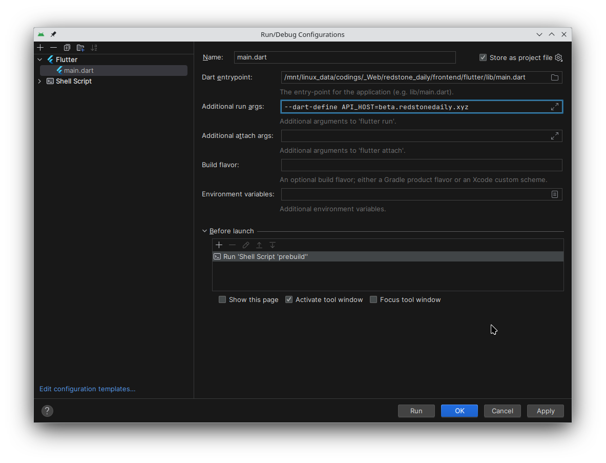
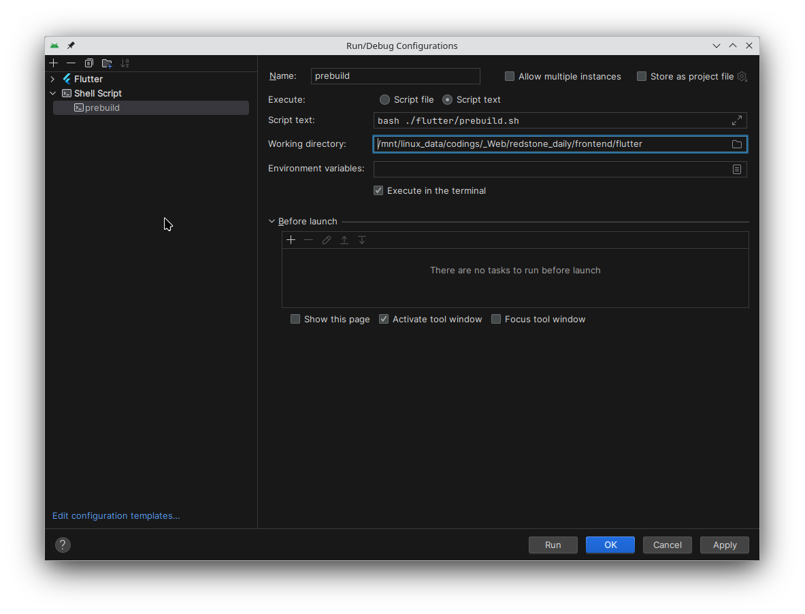

# redstone_daily_site

[红石日报 Redstone Daily 介绍](https://github.com/RedstoneDaily/redstone_daily)

这是红石日报的前端

**PR尽量往develop分支上推哦! 阿里嘎多~**

[changelog](./changelog.md)

# 注意事项（Flutter工程）

### 杂项

- Flutter的web渲染引擎需设置为canvaskit才能清晰显示主页里的那些低清像素mc物品图片，否则会被“优化”图片会变模糊
- 为了使页面调取打包的canvaskit而非gstatic源的canvaskit，使用dart-define变量`FLUTTER_WEB_CANVASKIT_URL`以指定canvaskit的url，即在flutter build命令里加上参数：
```
--dart-define=FLUTTER_WEB_CANVASKIT_URL=/canvaskit/
```
参考：https://github.com/flutter/flutter/pull/92134
另：服务器会将这些个别大体积资源重定向到cdn img上，但是文件还是得塞进assets和flutter build里 这样页面才能认我们自己的资源（

### Aegis & prebuild脚本

项目使用Aegis平台进行性能观测，有两种途径——

一种是引入aegis_flutter的flutter包（但是这个勾八东西依赖0.x版本的http包 项目的其他依赖又依赖于1.x版本http包 会有依赖冲突 所以用不了）

然后另一种是往index.html里插入html片段（是一些script标签，会引入&执行脚本，html片段内容从web/aegis-script.html读取）

所以index.html现在是生成性文件，使用预构建脚本prebuild.sh以web/template.html为模板，使用envsubst命令将其中的`$AEGIS_SCRIPT`替换为对应html片段（如果不启用aegis则替换为空），生成index.html；

要修改index.html内容的话请在template.html里修改

然后 flutter build 之前记得执行一下`prebuild.sh` (linux) 或 `prebuild.bat` (windows) 谢谢喵
**Linux**:
```bash
./prebuild.sh && flutter build web --web-renderer canvaskit --dart-define=FLUTTER_WEB_CANVASKIT_URL=/canvaskit/
```
**Windows**:
```powershell
prebuild.bat && flutter build web --web-renderer canvaskit --dart-define=FLUTTER_WEB_CANVASKIT_URL=/canvaskit/
```


传递`--aegis [env-type]`参数即可启用aegis观测，指定env-type可将观测流量标记分类至不同环境种类
```bash
./prebuild.sh --aegis local && flutter build web --web-renderer canvaskit --dart-define=FLUTTER_WEB_CANVASKIT_URL=/canvaskit/
```
`env-type` 可选值:
- `prod` 生产环境
- `dev` 开发环境
- `gray` 灰度环境
- `pre` 预发布环境
- `daily` 日发布环境
- `local` 本地环境
- `test` 测试环境
- `others` 其他环境(默认值)

### `API_HOST` dart-define变量

由于测试服的api请求需要指向正式服域名（不然没日报数据），但某些时候也可能会需要改指回测试服api以进行一些测试；在本地测试后端时也可能需要指向localhost以进行测试/查看

所以项目使用dart-define变量`API_HOST`以指定api请求的目标域名

默认值统一为空字符串，如需控制目标域名请在flutter CLI里使用dart-define设置此变量

如果此变量未定义或为空字符串，则发起api请求时应不设定域名——此时api请求将有可能使用cdn的域名，以提升网络性能

代码例子：flutter/lib/contentPage/content_list.dart:
```
    const String apiHost = String.fromEnvironment('API_HOST', defaultValue: '');
    Uri uri = apiHost != ''
        ? Uri.https(apiHost, '/api/daily', {
            'yy': widget.year,
            'mm': widget.month,
            'dd': widget.day,
          })
        : Uri.parse('/api/daily?yy=${widget.year}&mm=${widget.month}&dd=${widget.day}');
```

用例：.github/workflows/ci-build-flutter.yml:
```
- name: Build Web (develop)
  if: github.ref == 'refs/heads/develop'        
  run: ./prebuild.sh --aegis dev && flutter build web --release --source-maps --web-renderer canvaskit --dart-define=FLUTTER_WEB_CANVASKIT_URL=/canvaskit/ --dart-define=API_HOST=redstonedaily.top
```
测试服的CD会将此变量定义为"redstonedaily.top"（指向正式服api，但某些时候可能会需要改指测试服api以进行一些测试）；

正式服不定义此变量。

## Android Studio 开发环境配置（的一点tips）：

由于现在在试验其他框架，Flutter工程被移入/flutter文件夹内，另外结合上述提示，可能需要小改一下运行配置：



- Dart entrypoint需要改到**flutter文件夹下**的lib/main.dart里
- 按需指定dart-define变量
- 在启动前运行另一个运行配置，运行prebuild脚本

新建一个运行配置，类型是Shell Script（不知道中文咋翻的），如图



Execute类型选择Script Text

工作目录在Flutter文件夹下

然后Script text里填`bash ./prebuild.sh --aegis local`（Linux）`.\prebuild.bat --aegis local`（Windows）

然后Working directory填入项目根目录即可
